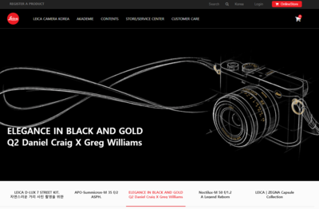

# leica-clone
라이카 클론코딩 반응형작업

## 고정형사이트를 반응형으로 개선
1. 테블릿사이즈 구현
2. 모바일사이즈 구현
3. 아이폰 5s 대응

## ux 개편
1. a tag의 사이즈가 없거나 영역이 너무 작은 경우를 수정
2. button, a tag의 hover effect를 추가하여 사용성을 개편함.
3. dropdown 메뉴의 사용성 개선

## 서브페이지 제작
1. 각 섹션별 대표페이지 반응형으로 개선

